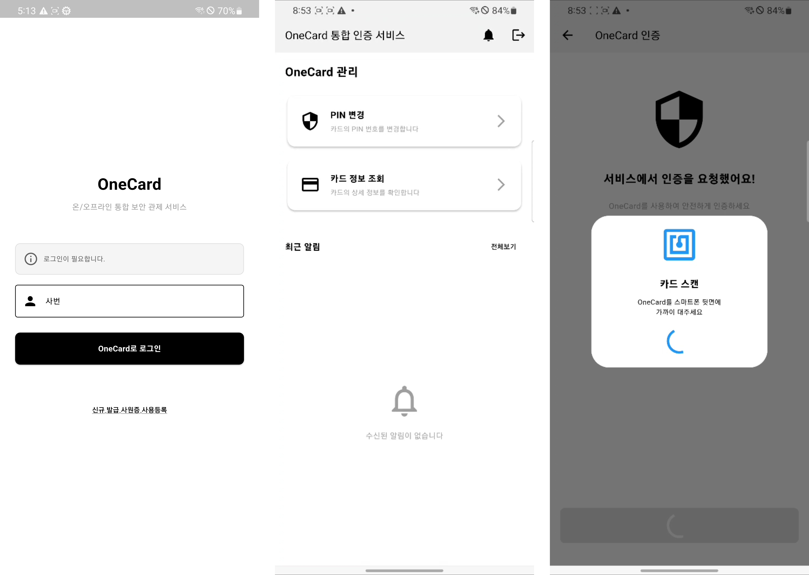

## OneCard Authenticator

OneCard Authenticator 앱은 조직 구성원이 온라인 서비스에서 OneCard를 사용한 인증을 수행할 때 ID 카드와 서버 간 인증 정보 교환 터널로서 기능합니다.<br><br>

이 레포지터리는 [OneCard 프로젝트](https://github.com/OneCard-OSS)의 일부입니다.

## 개요
OneCard 플랫폼은 사원증과 같은 물리 보안 매체를 온라인에서도 사용할 수 있도록 OAuth 2.0 인터페이스를 노출하고 있습니다.

인증을 위해 연동된 사내 시스템에서 구성원이 OneCard 로그인을 시도하면 Authenticator 앱으로 인증을 요구하는 푸시 알림이 전송됩니다.

이후 알림을 수신한 사용자는 인증 요구의 출처를 확인한 후 자신의 ID 카드를 휴대폰에 태그하는 것으로 연동된 온라인 서비스에 로그인할 수 있습니다.  


## 설치 및 설정
프로젝트 루트의 `.env` 파일을 수정하여 서버 설정을 변경할 수 있습니다:

```env
# 로그인 및 API 서버 설정
API_BASE_URL=https://your-api-server.com
LOGIN_INITIATE_ENDPOINT=/app/api/initiate
LOGIN_VERIFY_ENDPOINT=/app/api/verify
TOKEN_REFRESH_ENDPOINT=/app/api/token
LOGOUT_ENDPOINT=/app/api/logout

# 푸시 알림 서버 설정
PUSH_SERVER_URL=http://your-push-server:5000
JWT_SECRET=your_jwt_secret_key

# 백그라운드 서비스 설정
BACKGROUND_SERVICE_INTERVAL_MINUTES=15
AUTO_RECONNECT_ATTEMPTS=3

# 개발/디버그 설정
DEBUG_MODE=true
LOG_LEVEL=debug
```


## 구현된 API 목록

### 로그인 시작
```
POST /app/api/initiate
Content-Type: application/json

{
  "emp_no": "사번"
}

Response:
{
  "attempt_id": "로그인 세션 식별자",
  "response": "hex 문자열"
}
```

### 로그인 검증
```
POST /app/api/verify
Content-Type: application/json

{
  "attempt_id": "로그인 세션 식별자",
  "pubkey": "카드_공개키",
  "encrypted_data": {
    "ciphertext": "암호화된_데이터"
  }
}

Response:
{
  "access_token": "액세스_토큰",
  "refresh_token": "리프레시_토큰",
  "token_type": "bearer",
  "expires_in": 3600
}
```

### 토큰 갱신
```
POST /app/api/token
Content-Type: application/json

{
  "refresh_token": "리프레시_토큰"
}

Response:
{
  "access_token": "새_액세스_토큰",
  "refresh_token": "새_리프레시_토큰",
  "token_type": "bearer",
  "expires_in": 3600
}
```

### 로그아웃
```
POST /app/api/logout
Authorization: Bearer 액세스_토큰

Response:
{
  "message": "Logout Successful"
}
```

## 파일 구조
```
lib/
├── config/
│   └── app_config.dart          # 환경 변수 관리
├── services/
│   ├── auth_service.dart        # 인증 서비스
│   ├── background_service.dart  # 백그라운드 서비스
│   └── secure_storage_service.dart # 보안 저장소
├── screens/
│   └── login_page.dart          # 로그인 화면
├── assets/
│   └── NFCCommands.dart         # NFC 명령어 유틸리티
├── nfc_operation.dart            # NFC 카드 통신
├── socket_service.dart          # Socket.IO 푸시 대기 서비스
├── push_notification_service.dart # 로컬 알림 서비스
├── deeplink_page.dart           # Deep Link 인증 요청 페이지
└── main.dart                    # 로그인 이후 메인 화면
```

### 주요 클래스

#### AppConfig
환경 변수를 관리하는 설정 클래스입니다.

#### SecureStorageService
Flutter Secure Storage를 사용하여 토큰을 안전하게 저장/조회합니다.

#### AuthService
로그인, 로그아웃, 토큰 갱신 등의 인증 관련 API를 호출합니다.

#### BackgroundService
WorkManager를 사용하여 백그라운드에서 푸시 서버 연결을 유지합니다.

#### NFCCardOperations
NFC 카드와의 통신을 담당합니다.
